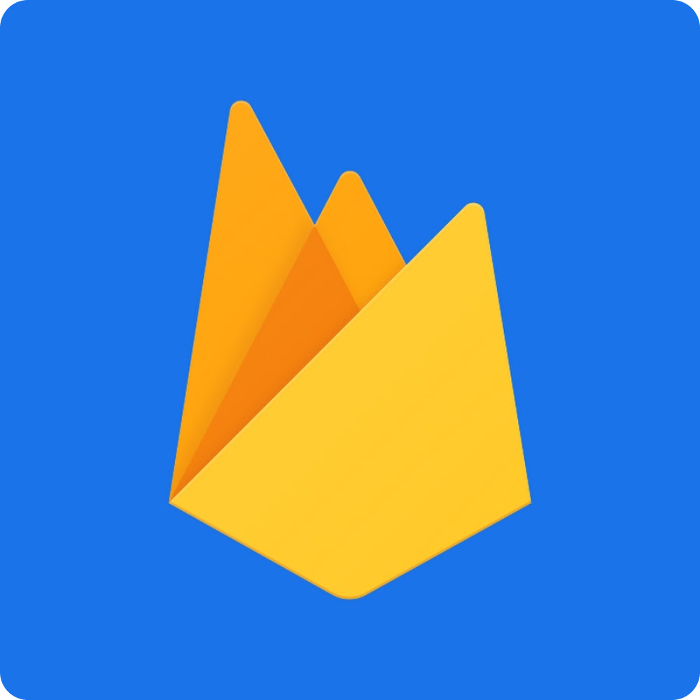
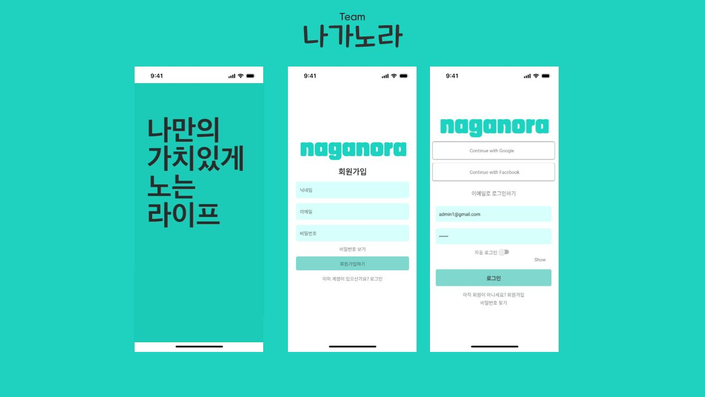

'나만의 가치있게 노는 라이프'의 줄임말로 나가서 노는 문화를 제공/공유 해주는 서비스입니다.

## 🐣 프로젝트 목표

⭐ 귀차니즘의 대명사 P(MBTI)들을 위한 장소 추천 서비스. 
⭐ 추천 코스, 약속, 사용자들이 추천하는 코스등을 유저들이 공유하여 앱을 사용할 수 있다. 
⭐ 가계부를 통해 일정에 사용된 비용을 확인할 수 있다. 
⭐ 투두리스트를 통해 일정을 기록할 수 있다.

## 🐣 팀원소개

|                                              |                                            |                                              |                                              |                                              |
| :------------------------------------------: | :----------------------------------------: | :------------------------------------------: | :------------------------------------------: | :------------------------------------------: |
|  |  |  |  |  |
|    [이준영](https://github.com/moko0428)     |    [조윤서](https://github.com/zyyyun)     |     [문서진](https://github.com/ba-bam)      |    [정지민](https://github.com/wlals262)     |   [성동현](https://github.com/babycat1526)   |

## 🐣 프로젝트 소개

⭐ 팀명: #F4 감성 모르면 나가라 
⭐ 프로젝트명: 나가노라 
⭐ 프로젝트 기간: 2024.04.08 ~ 2024.05.17 
⭐ 팀 노션: [최종 팀 노션 페이지](https://www.notion.so/prgrms/Team-4-F4-67820a9cbf41407c891456161cd477ae)

## 🐣 사용기술

|                                         |                                         |                                           |     |     |
| :-------------------------------------: | :-------------------------------------: | :---------------------------------------: | :-: | :-: |
|  |  |  |
|               React-Naive               |               JavaScript                |                 Firebase                  |

## 🐣 구현

